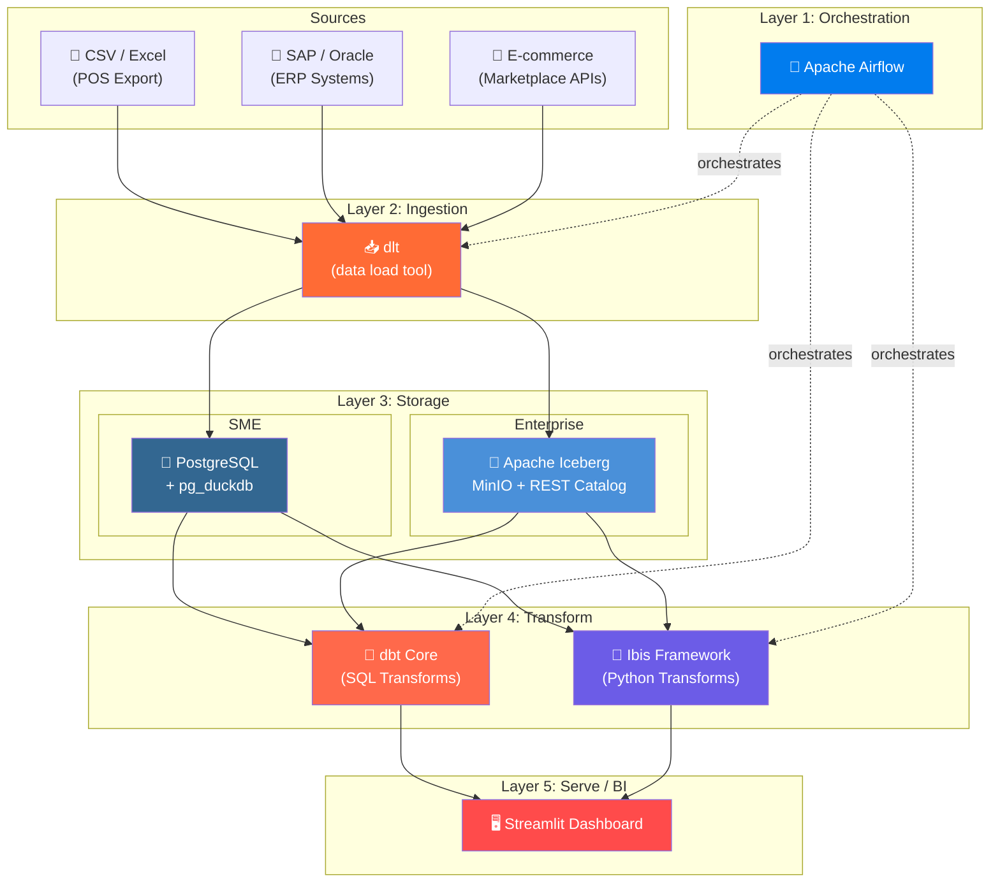
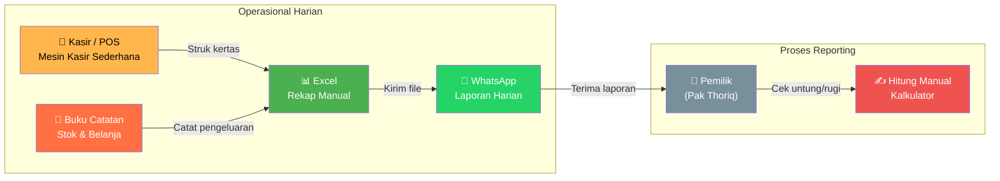
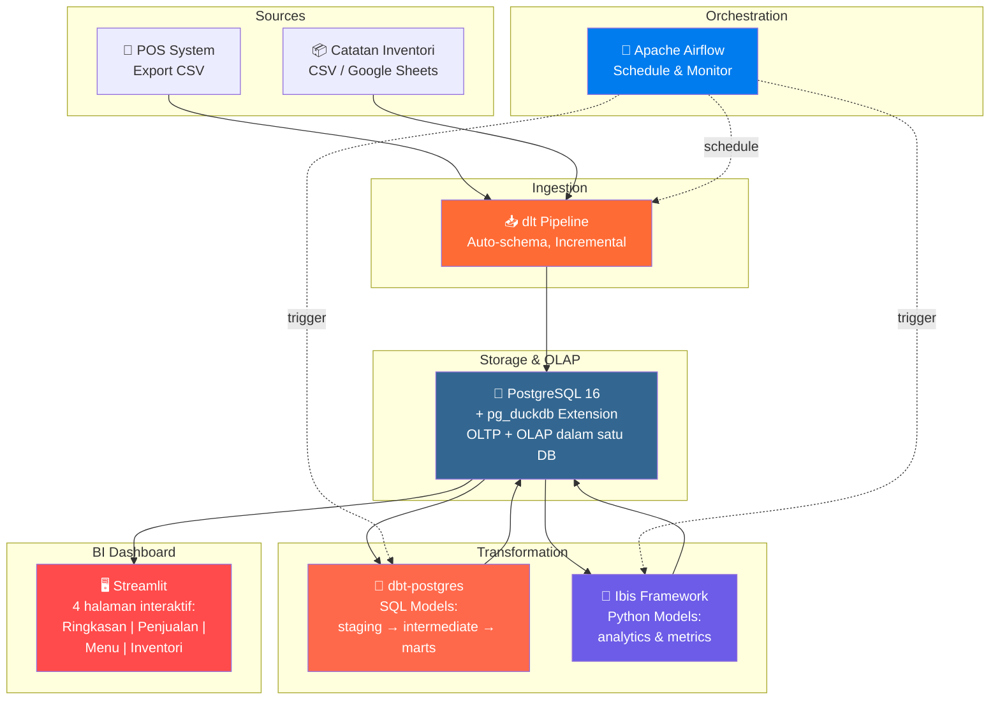
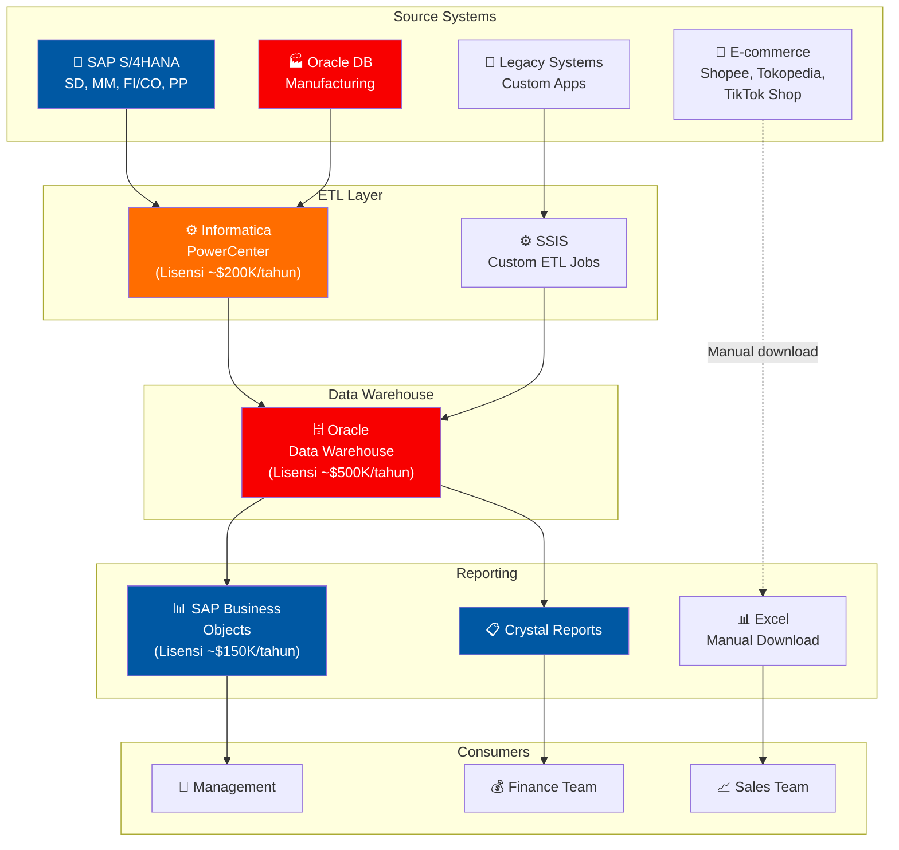
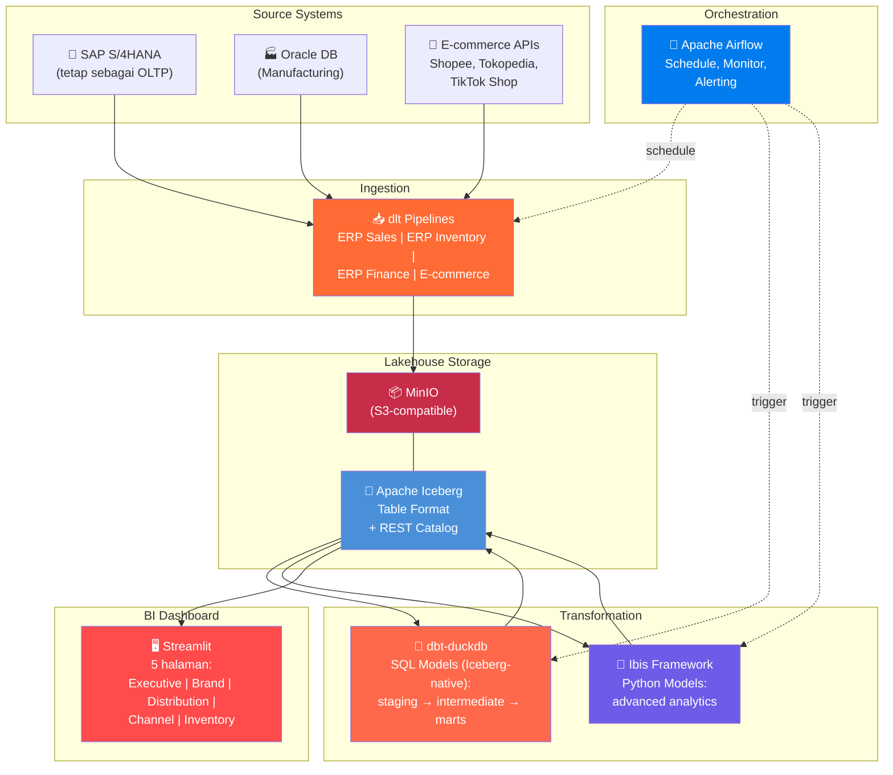
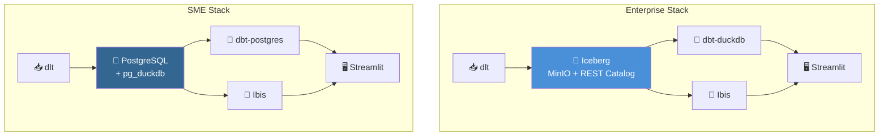
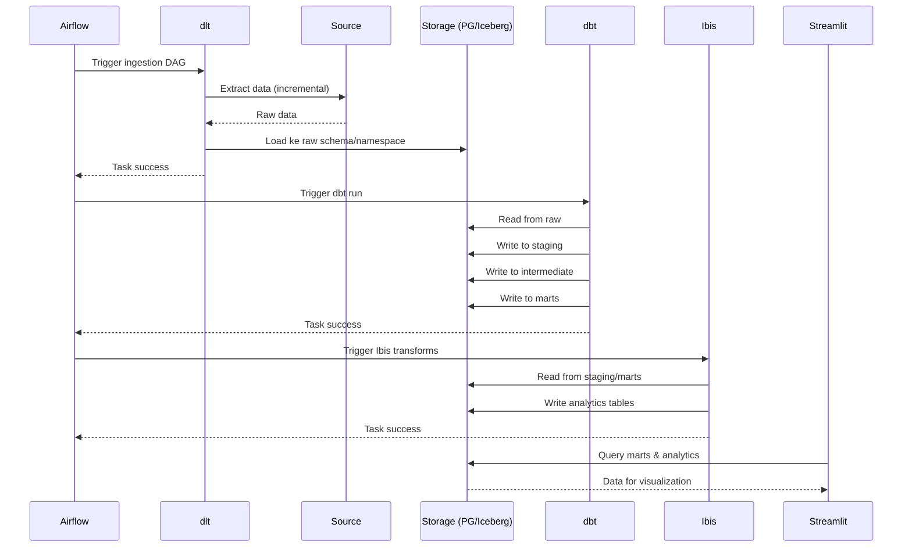

# 01 — Arsitektur Overview

## Arsitektur Referensi: Modern Python Data Stack

Berikut adalah arsitektur referensi yang digunakan di kedua studi kasus. Setiap layer menggunakan komponen yang **sama secara konseptual**, hanya berbeda di skala dan pilihan storage.

---

## Mapping Komponen per Layer

| Layer | Fungsi | SME (Haji Thoriq) | Enterprise (PJI Group) |
|:------|:-------|:-------------------|:----------------------|
| **Sources** | Sumber data | CSV export dari POS, catatan manual | SAP S/4HANA (SD, MM, FI), Oracle (manufaktur), marketplace APIs |
| **Orchestration** | Scheduling & monitoring | Apache Airflow 3.x | Apache Airflow 3.x |
| **Ingestion** | Extract & Load | dlt → PostgreSQL | dlt → Apache Iceberg (via PyIceberg) |
| **Storage (OLTP)** | Operational data | PostgreSQL 16 | PostgreSQL 16 (simulasi SAP) |
| **Storage (OLAP)** | Analytical queries | pg_duckdb (in-process) | Apache Iceberg + MinIO + REST Catalog |
| **Transform (SQL)** | SQL-based transforms | dbt-postgres | dbt-duckdb (Iceberg support) |
| **Transform (Python)** | Python-based transforms | Ibis (PostgreSQL backend) | Ibis (DuckDB + Iceberg backend) |
| **BI / Serve** | Dashboard & reporting | Streamlit | Streamlit |

---

## Studi Kasus 1: Bebek Goreng Spesial Haji Thoriq (SME)

### BEFORE: Arsitektur Legacy

#### Pain Points Arsitektur Legacy SME

| # | Pain Point | Dampak Bisnis |
|:--|:-----------|:-------------|
| 1 | **Data silos** — data tersebar di Excel, WhatsApp, buku | Tidak bisa lihat gambaran menyeluruh |
| 2 | **Manual entry** — rentan human error | Selisih stok, salah hitung laba |
| 3 | **No real-time visibility** — laporan T+1 atau lebih | Keputusan terlambat (stok habis, menu tidak laku) |
| 4 | **Tidak scalable** — tambah cabang = tambah Excel | Makin rumit seiring pertumbuhan |
| 5 | **No historical analysis** — data lama hilang/tercecer | Tidak bisa analisis tren musiman |

### AFTER: Modern Python Data Stack (SME)

#### Keunggulan Arsitektur Baru SME

| # | Keunggulan | Detail |
|:--|:-----------|:-------|
| 1 | **Single source of truth** | Semua data di PostgreSQL, satu database |
| 2 | **Automated pipeline** | Airflow menjalankan pipeline otomatis setiap hari |
| 3 | **OLAP performance** | pg_duckdb mempercepat query analitik 10-100x |
| 4 | **Dashboard real-time** | Streamlit bisa diakses dari HP/tablet |
| 5 | **Biaya ~Rp 0** | Semua open-source, bisa jalan di laptop/VPS murah |
| 6 | **Scalable** | Tambah cabang? Cukup tambah data source di dlt |

---

## Studi Kasus 2: PT Pesona Jelita Indonesia (Enterprise)

### BEFORE: Arsitektur Legacy Enterprise

#### Pain Points Arsitektur Legacy Enterprise

| # | Pain Point | Dampak Bisnis |
|:--|:-----------|:-------------|
| 1 | **Vendor lock-in** — SAP + Oracle + Informatica | Total lisensi ~$850K+/tahun |
| 2 | **T+3 reporting** — ETL batch semalam, data baru available H+3 | Keputusan bisnis terlambat |
| 3 | **Siloed e-commerce data** — tidak terintegrasi dengan ERP | Tidak bisa analisis omnichannel |
| 4 | **Rigid schema** — change request ke DW butuh minggu-bulan | Tidak agile mengikuti perubahan bisnis |
| 5 | **Skill gap** — butuh ABAP developer, Oracle DBA (mahal & langka) | Sulit rekrut & retain talent |
| 6 | **No data lake** — raw data tidak disimpan | Tidak bisa retrain ML models |
| 7 | **Single point of failure** — Oracle DW down = semua report mati | Downtime = lost revenue visibility |

### AFTER: Modern Python Data Stack (Enterprise)

#### Keunggulan Arsitektur Baru Enterprise

| # | Keunggulan | Detail |
|:--|:-----------|:-------|
| 1 | **Hemat biaya 70-80%** | Open-source menggantikan lisensi SAP BO + Oracle DW + Informatica |
| 2 | **Near real-time** | Pipeline bisa berjalan setiap 15 menit, bukan batch semalam |
| 3 | **Omnichannel analytics** | E-commerce data terintegrasi di lakehouse yang sama |
| 4 | **Schema evolution** | Iceberg mendukung schema evolution tanpa downtime |
| 5 | **Time travel** | Iceberg snapshot memungkinkan query data historis |
| 6 | **Talent friendly** | Python + SQL — skillset yang lebih umum & mudah direkrut |
| 7 | **Open format** | Iceberg = open table format, tidak ada vendor lock-in |
| 8 | **Separation of storage & compute** | MinIO (storage) bisa scale independen dari compute |

---

## Perbandingan Arsitektur Side-by-Side

> **Perhatikan**: Layer ingestion, transformation, orchestration, dan BI **identik**. Hanya layer storage/OLAP yang berbeda. Ini adalah kekuatan utama modern Python data stack — **portabilitas**.

---

## Data Flow Detail

### Alur Data End-to-End

---

Selanjutnya: [02 — Studi Kasus SME: Bebek Goreng Haji Thoriq →](02-studi-kasus-sme.md)
