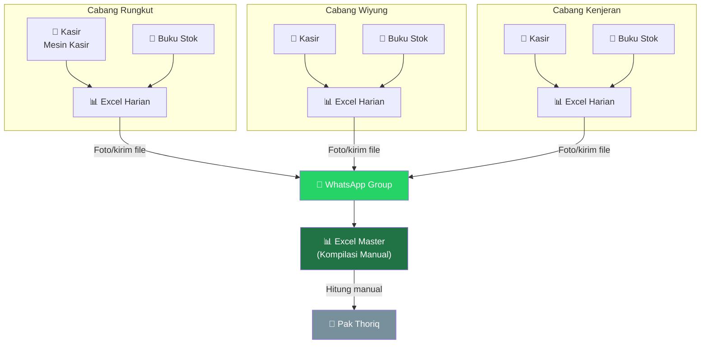
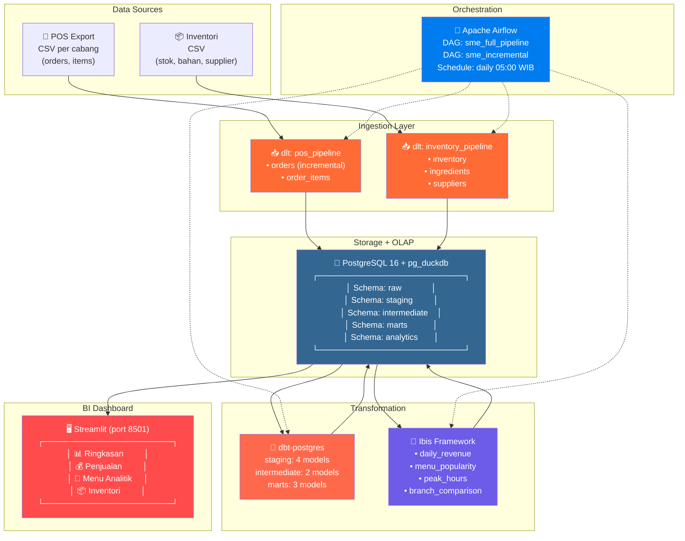
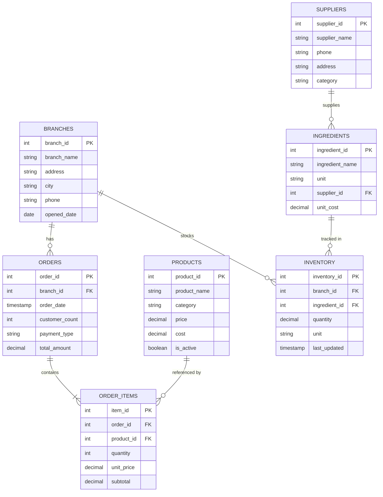
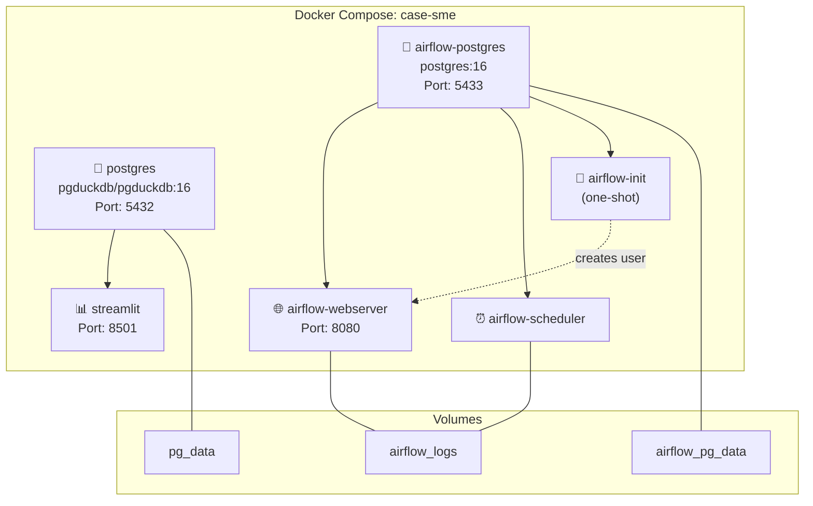
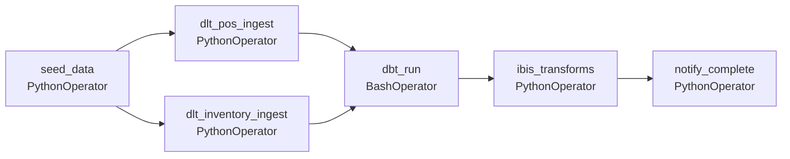
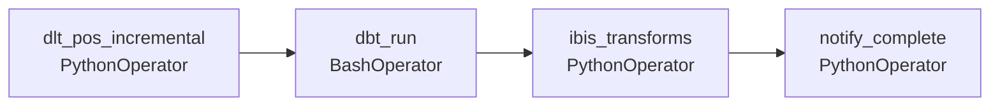

# 02 — Studi Kasus SME: Bebek Goreng Spesial Haji Thoriq

## Profil Bisnis

| Aspek | Detail |
|:------|:-------|
| **Nama Usaha** | Bebek Goreng Spesial Haji Thoriq |
| **Jenis** | Warung makan / Restoran lokal |
| **Didirikan** | 2010 |
| **Pemilik** | H. Muhammad Thoriq |
| **Lokasi** | Surabaya, Jawa Timur |
| **Cabang** | 3 cabang: Rungkut (pusat), Wiyung, Kenjeran |
| **Karyawan** | ~25 orang (total semua cabang) |
| **Omzet** | ~Rp 150-200 juta / bulan |
| **Menu Andalan** | Bebek goreng kremes, bebek bakar, sambal korek |

### Latar Belakang

Bebek Goreng Spesial Haji Thoriq dimulai dari gerobak kecil di pinggir jalan Rungkut tahun 2010. Berkat resep sambal korek yang khas dan bebek goreng yang renyah, usaha ini berkembang pesat. Tahun 2018, Pak Thoriq membuka cabang kedua di Wiyung, dan tahun 2021 cabang ketiga di Kenjeran.

Dengan 3 cabang, Pak Thoriq mulai kesulitan memantau performa bisnis. Setiap cabang mengirim laporan harian via WhatsApp dalam format yang berbeda-beda. Rekonsiliasi stok bahan baku dilakukan manual setiap akhir bulan, dan sering ditemukan selisih.

---

## BEFORE: Arsitektur Legacy

### Cara Kerja Lama

```
Alur Harian:
1. Kasir mencatat penjualan di mesin kasir sederhana
2. Akhir hari: kasir rekap ke Excel/tulis di buku
3. Manajer cabang kirim foto Excel via WhatsApp ke Pak Thoriq
4. Pak Thoriq (atau admin) kompilasi manual ke Excel master
5. Akhir bulan: hitung untung/rugi pakai kalkulator + Excel

Alur Stok:
1. Bagian dapur catat pemakaian bahan di buku
2. Akhir minggu: cek stok fisik
3. Kalau kurang, WhatsApp ke supplier untuk pesan
4. Tidak ada tracking harga supplier dari waktu ke waktu
```

### Diagram Arsitektur Legacy



### Pain Points Detail

| Masalah | Contoh Nyata | Frekuensi |
|:--------|:------------|:----------|
| Data tidak konsisten | Cabang Wiyung kirim format beda tiap hari | Harian |
| Selisih stok | Bawang merah tercatat 50 kg, aktual 35 kg | Mingguan |
| Laporan terlambat | Manajer lupa kirim, laporan baru available H+2 | 2-3x/minggu |
| Tidak bisa bandingkan cabang | Harus buka 3 file Excel berbeda | Setiap kali review |
| Menu mana yang paling laris? | Harus hitung manual per item | Jarang dilakukan |
| Kapan jam ramai? | Tidak ada data per jam | Tidak pernah |
| Tren musiman | Data lama sudah hilang/terformat ulang | Tidak mungkin |

---

## AFTER: Modern Python Data Stack

### Arsitektur Baru



---

## Data Model

### Entity Relationship Diagram



### Detail Tabel

#### Tabel `branches`
| Kolom | Tipe | Deskripsi |
|:------|:-----|:---------|
| branch_id | INT PK | ID cabang |
| branch_name | VARCHAR(100) | Nama cabang (Rungkut, Wiyung, Kenjeran) |
| address | TEXT | Alamat lengkap |
| city | VARCHAR(50) | Kota |
| phone | VARCHAR(20) | Nomor telepon |
| opened_date | DATE | Tanggal buka |

#### Tabel `products` (Menu)
| Kolom | Tipe | Deskripsi |
|:------|:-----|:---------|
| product_id | INT PK | ID menu |
| product_name | VARCHAR(100) | Nama menu |
| category | VARCHAR(50) | Kategori: makanan_utama, sambal, minuman, tambahan |
| price | DECIMAL(10,2) | Harga jual |
| cost | DECIMAL(10,2) | Harga pokok (estimasi) |
| is_active | BOOLEAN | Masih tersedia atau tidak |

#### Daftar Menu (Contoh Data)

| Menu | Kategori | Harga |
|:-----|:---------|------:|
| Bebek Goreng Kremes | makanan_utama | Rp 35.000 |
| Bebek Goreng Sambal Ijo | makanan_utama | Rp 37.000 |
| Bebek Bakar | makanan_utama | Rp 40.000 |
| Bebek Goreng Crispy | makanan_utama | Rp 38.000 |
| Ayam Goreng Kremes | makanan_utama | Rp 25.000 |
| Ayam Bakar | makanan_utama | Rp 28.000 |
| Nasi Putih | tambahan | Rp 5.000 |
| Lalapan Komplit | tambahan | Rp 5.000 |
| Tahu/Tempe Goreng | tambahan | Rp 5.000 |
| Sambal Korek (Ekstra) | sambal | Rp 3.000 |
| Sambal Matah | sambal | Rp 4.000 |
| Sambal Bawang | sambal | Rp 3.000 |
| Es Teh Manis | minuman | Rp 5.000 |
| Es Jeruk | minuman | Rp 7.000 |
| Teh Hangat | minuman | Rp 4.000 |
| Jus Alpukat | minuman | Rp 12.000 |

#### Tabel `orders`
| Kolom | Tipe | Deskripsi |
|:------|:-----|:---------|
| order_id | INT PK | ID transaksi |
| branch_id | INT FK | Cabang mana |
| order_date | TIMESTAMP | Tanggal & waktu order |
| customer_count | INT | Jumlah orang dalam rombongan |
| payment_type | VARCHAR(20) | cash / qris / transfer |
| total_amount | DECIMAL(12,2) | Total pembayaran |

#### Tabel `order_items`
| Kolom | Tipe | Deskripsi |
|:------|:-----|:---------|
| item_id | INT PK | ID item |
| order_id | INT FK | Referensi ke orders |
| product_id | INT FK | Referensi ke products |
| quantity | INT | Jumlah pesanan |
| unit_price | DECIMAL(10,2) | Harga satuan saat order |
| subtotal | DECIMAL(10,2) | quantity × unit_price |

#### Tabel `suppliers`, `ingredients`, `inventory`
Tabel pendukung untuk tracking bahan baku dan stok per cabang.

---

## Synthetic Data Specification

### Volume Data

| Tabel | Jumlah Record | Periode |
|:------|:-------------|:--------|
| branches | 3 | Statis |
| products | 16 | Statis |
| orders | ~3,000 | 6 bulan terakhir |
| order_items | ~7,500 | 6 bulan (avg 2.5 items/order) |
| suppliers | 8 | Statis |
| ingredients | 20 | Statis |
| inventory | 60 | 3 cabang × 20 bahan |

### Pattern yang Harus Disimulasikan

1. **Weekend effect**: Sabtu-Minggu 40-60% lebih ramai dari weekday
2. **Peak hours**: Jam makan siang (11:00-14:00) dan malam (17:00-21:00)
3. **Best seller**: Bebek Goreng Kremes ~30% dari total order
4. **Payment mix**: 50% cash, 35% QRIS, 15% transfer
5. **Branch performance**: Rungkut paling ramai (40%), Wiyung (35%), Kenjeran (25%)
6. **Seasonal**: Bulan Ramadhan omzet naik 30-50%
7. **Growth trend**: Omzet naik gradual ~5% per bulan

---

## Docker Compose Architecture



### Environment Variables (.env.example)

```bash
# === PostgreSQL (Aplikasi) ===
POSTGRES_USER=sme_user
POSTGRES_PASSWORD=sme_password_2024
POSTGRES_DB=sme_db
POSTGRES_PORT=5432

# === PostgreSQL (Airflow Metadata) ===
AIRFLOW_PG_USER=airflow
AIRFLOW_PG_PASSWORD=airflow_password_2024
AIRFLOW_PG_DB=airflow_db
AIRFLOW_PG_PORT=5433

# === Airflow ===
AIRFLOW_UID=50000
AIRFLOW__CORE__FERNET_KEY=your-fernet-key-here
AIRFLOW__CORE__LOAD_EXAMPLES=false
AIRFLOW_ADMIN_USER=airflow
AIRFLOW_ADMIN_PASSWORD=airflow

# === Streamlit ===
STREAMLIT_PORT=8501

# === dlt ===
DLT_DESTINATION=postgres
DLT_DATASET_NAME=raw
```

---

## Transformasi dbt

### Struktur Model

```
transform_dbt/
├── dbt_project.yml
├── profiles.yml
├── models/
│   ├── staging/
│   │   ├── _staging.yml              # Documentation & tests
│   │   ├── stg_orders.sql            # Clean orders
│   │   ├── stg_order_items.sql       # Clean order items
│   │   ├── stg_products.sql          # Clean products
│   │   └── stg_inventory.sql         # Clean inventory
│   ├── intermediate/
│   │   ├── int_daily_sales.sql       # Daily sales per branch
│   │   └── int_product_performance.sql # Product-level metrics
│   └── marts/
│       ├── mart_revenue_summary.sql  # Revenue by month/branch
│       ├── mart_menu_analytics.sql   # Menu performance ranking
│       └── mart_inventory_forecast.sql # Reorder predictions
```

### Contoh Model SQL

**staging/stg_orders.sql:**
```sql
WITH source AS (
    SELECT * FROM {{ source('raw', 'orders') }}
),
cleaned AS (
    SELECT
        order_id,
        branch_id,
        order_date,
        DATE(order_date) AS order_date_day,
        EXTRACT(HOUR FROM order_date) AS order_hour,
        EXTRACT(DOW FROM order_date) AS day_of_week,
        customer_count,
        payment_type,
        total_amount
    FROM source
    WHERE total_amount > 0
)
SELECT * FROM cleaned
```

**marts/mart_revenue_summary.sql:**
```sql
WITH daily AS (
    SELECT * FROM {{ ref('int_daily_sales') }}
)
SELECT
    DATE_TRUNC('month', order_date_day) AS month,
    branch_name,
    SUM(daily_revenue) AS monthly_revenue,
    SUM(daily_orders) AS monthly_orders,
    ROUND(SUM(daily_revenue) / NULLIF(SUM(daily_orders), 0), 0) AS avg_ticket_size,
    SUM(daily_customers) AS monthly_customers
FROM daily
GROUP BY 1, 2
ORDER BY 1 DESC, 2
```

---

## Transformasi Ibis

### Contoh Transform Python

```python
import ibis

# Connect to PostgreSQL
con = ibis.postgres.connect(
    host="postgres", port=5432,
    user="sme_user", password="sme_password_2024",
    database="sme_db"
)

# --- Model 1: Menu Popularity ---
orders = con.table("orders", schema="raw")
items = con.table("order_items", schema="raw")
products = con.table("products", schema="raw")

menu_popularity = (
    items
    .join(products, items.product_id == products.product_id)
    .group_by([products.product_name, products.category])
    .agg(
        total_quantity=items.quantity.sum(),
        total_revenue=items.subtotal.sum(),
        order_count=items.order_id.nunique(),
    )
    .order_by(ibis.desc("total_revenue"))
)

# Materialize ke tabel analytics
con.create_table("menu_popularity", menu_popularity, schema="analytics",
                  overwrite=True)

# --- Model 2: Peak Hours Analysis ---
peak_hours = (
    orders
    .mutate(hour=orders.order_date.hour())
    .group_by(["branch_id", "hour"])
    .agg(
        order_count=orders.order_id.count(),
        avg_amount=orders.total_amount.mean(),
    )
    .order_by(["branch_id", ibis.desc("order_count")])
)

con.create_table("peak_hours", peak_hours, schema="analytics",
                  overwrite=True)
```

---

## Dashboard Streamlit

### Halaman & Komponen

#### 1. 📊 Ringkasan (Overview)
- KPI Cards: Total Revenue, Total Orders, Avg Ticket Size, Total Customers
- Revenue Trend (line chart, 6 bulan)
- Perbandingan Revenue per Cabang (bar chart)
- Tabel ringkasan bulan berjalan

#### 2. 💰 Penjualan
- Filter: tanggal, cabang, payment type
- Daily revenue chart
- Revenue heatmap (hari × jam)
- Payment method distribution (pie chart)
- Top 5 hari penjualan tertinggi

#### 3. 🍗 Menu Analitik
- Menu ranking by revenue & quantity
- Category breakdown
- Menu contribution (pareto chart)
- Margin analysis (jika data cost tersedia)

#### 4. 📦 Inventori
- Current stock levels per cabang
- Ingredients usage rate
- Low stock alerts
- Supplier summary

---

## Airflow DAGs

### DAG 1: `sme_full_pipeline` (Full Refresh)



### DAG 2: `sme_incremental` (Daily Incremental)



---

## Estimasi Biaya Operasional

| Komponen | Opsi 1: Laptop/PC | Opsi 2: VPS Cloud |
|:---------|:-------------------|:-------------------|
| Server | Rp 0 (pakai laptop) | Rp 200-400K/bulan (DigitalOcean/Biznet) |
| Database | Rp 0 (PostgreSQL) | Rp 0 (PostgreSQL) |
| Airflow | Rp 0 (self-hosted) | Rp 0 (self-hosted) |
| Dashboard | Rp 0 (Streamlit) | Rp 0 (Streamlit) |
| **Total** | **Rp 0/bulan** | **Rp 200-400K/bulan** |

> Bandingkan dengan solusi SaaS: Metabase Cloud ($85/bulan) + Fivetran ($120/bulan) + dbt Cloud ($50/bulan) = **$255/bulan (~Rp 4 juta)**

---

← [01 — Arsitektur Overview](01-arsitektur-overview.md) | [03 — Studi Kasus Enterprise →](03-studi-kasus-enterprise.md)
