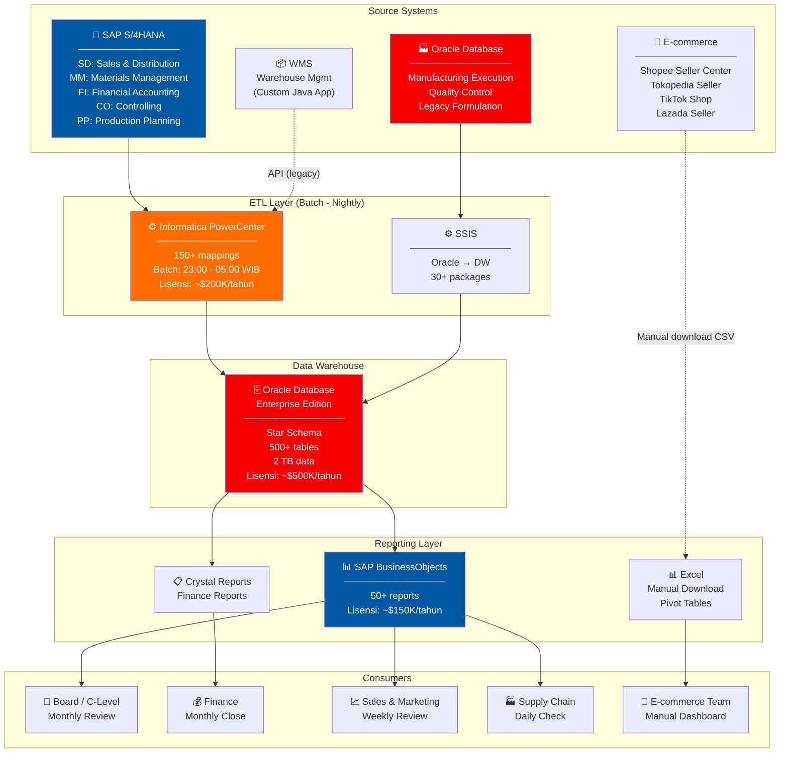
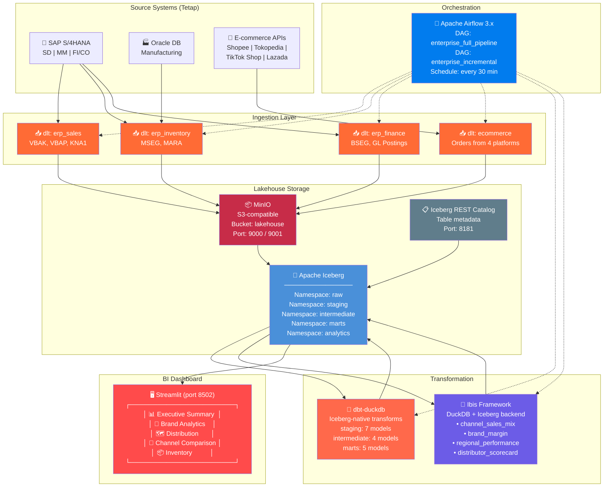
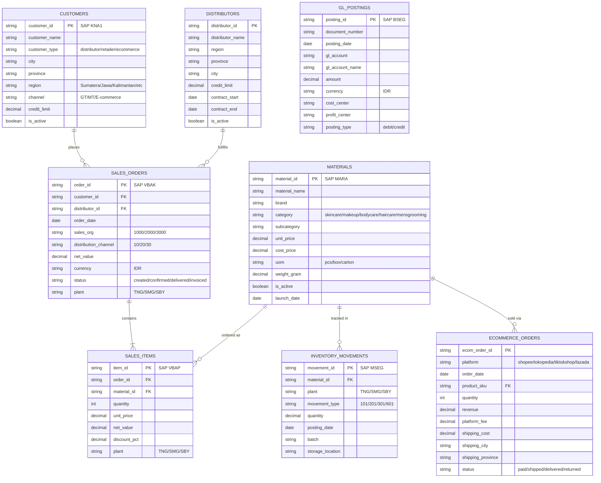
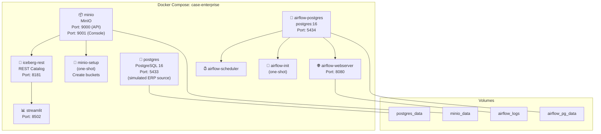
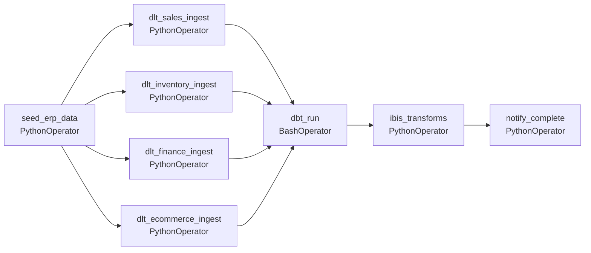
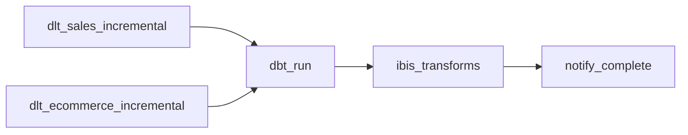
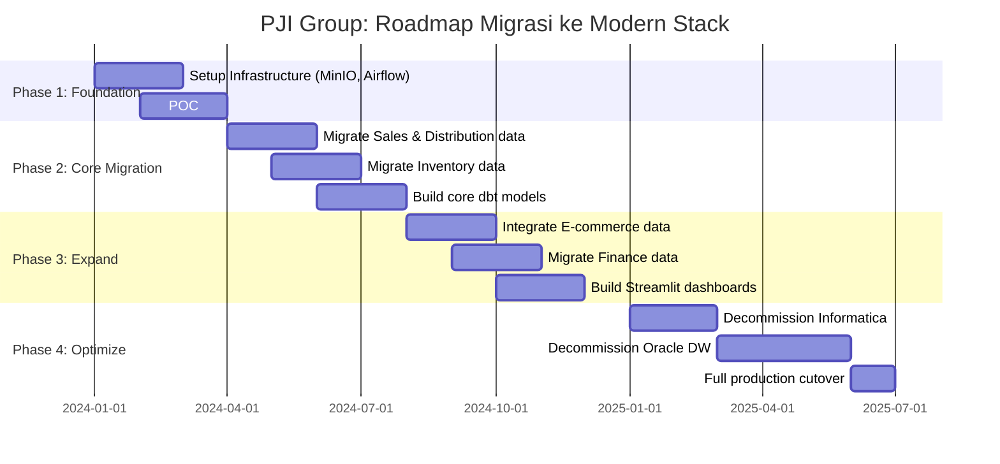

# 03 — Studi Kasus Enterprise: PT Pesona Jelita Indonesia (PJI Group)

## Profil Perusahaan

| Aspek | Detail |
|:------|:-------|
| **Nama Perusahaan** | PT Pesona Jelita Indonesia (PJI Group) |
| **Jenis** | FMCG — Kosmetik & Personal Care |
| **Didirikan** | 1985 |
| **Headquarters** | Jakarta Selatan |
| **Pabrik** | 3 lokasi: Tangerang, Semarang, Surabaya |
| **Karyawan** | ~8,000 orang |
| **Annual Revenue** | ~Rp 5 Triliun |
| **Brand Portfolio** | 15+ brand |
| **Distributor** | 50+ distributor utama |
| **Outlet Coverage** | 200,000+ outlet se-Indonesia |
| **ERP** | SAP S/4HANA (core), Oracle (legacy manufacturing) |
| **Sertifikasi** | Halal MUI, BPOM, ISO 9001, ISO 14001 |

### Brand Portfolio (Fictitious)

| Brand | Kategori | Segment | Revenue Share |
|:------|:---------|:--------|:-------------|
| **Jelita** | Skincare | Premium | 25% |
| **Pesona** | Makeup | Mass Market | 20% |
| **Cahaya** | Bodycare | Mid-range | 15% |
| **Lestari** | Halal Cosmetics | Mass Market | 12% |
| **Dewi** | Hair Care | Mid-range | 10% |
| **Bintang** | Men's Grooming | Mass Market | 5% |
| **Nusa** | Baby Care | Mid-range | 5% |
| Others (8 brands) | Various | Various | 8% |

### Channel Distribution

```
Channel Mix:
┌────────────────────────────────────────────────────┐
│ ████████████████████████████████████░░░░░░░░░░░░░ │
│ General Trade (70%)                                │
│ ░░░░░░░░░░░░░░░████████░░░░░░░░░░░░░░░░░░░░░░░░ │
│               Modern Trade (15%)                   │
│ ░░░░░░░░░░░░░░░░░░░░░░░░░░░░░████████░░░░░░░░░░ │
│                              E-commerce (15%)      │
└────────────────────────────────────────────────────┘

General Trade  : Toko kelontong, toko kosmetik tradisional, pasar
Modern Trade   : Indomaret, Alfamart, Guardian, Watsons, Matahari
E-commerce     : Shopee (40%), Tokopedia (30%), TikTok Shop (20%), Lazada (10%)
```

---

## BEFORE: Arsitektur Legacy

### Infrastruktur IT Existing



### Pain Points Detail

| # | Kategori | Pain Point | Dampak Bisnis | Annual Cost |
|:--|:---------|:-----------|:-------------|:------------|
| 1 | **Biaya** | Oracle DW + Informatica + SAP BO licensing | Vendor lock-in | ~$850K/tahun |
| 2 | **Latency** | ETL batch berjalan semalam, data available T+1 sampai T+3 | Keputusan bisnis terlambat, kehilangan momentum di e-commerce | — |
| 3 | **Silos** | E-commerce data tidak terintegrasi (download manual CSV) | Tidak bisa analisis omnichannel, marketing budget tidak optimal | ~Rp 2M lost revenue/tahun |
| 4 | **Rigidity** | Menambah kolom di DW butuh change request 2-4 minggu | Tim data tidak agile, business user frustrasi | — |
| 5 | **Talent** | Butuh ABAP developer ($25K/tahun), Oracle DBA ($20K/tahun) | Sulit rekrut & retain, single point of failure | — |
| 6 | **Scale** | Oracle DW tidak efisien untuk query ad-hoc besar | Report timeout, user mengeluh, rerun query | — |
| 7 | **No Raw Data** | Data yang masuk DW sudah di-transform, raw data hilang | Tidak bisa audit trail, tidak bisa retrain ML model | — |
| 8 | **SPOF** | Oracle DW down = semua report mati | Downtime rata-rata 2x/bulan, 4 jam per kejadian | — |

### Total Cost of Ownership (Legacy)

```
Lisensi Software:
  Oracle Database Enterprise        $500,000/tahun
  Informatica PowerCenter           $200,000/tahun
  SAP BusinessObjects               $150,000/tahun
  ───────────────────────────────────────────────
  Subtotal Software                 $850,000/tahun

Infrastructure:
  Oracle DW Server (2x)             $120,000/tahun
  Informatica Server                 $60,000/tahun
  DR/Backup                          $40,000/tahun
  ───────────────────────────────────────────────
  Subtotal Infra                    $220,000/tahun

Personnel (dedicated):
  Oracle DBA (2x)                    $40,000/tahun
  Informatica Developer (2x)         $30,000/tahun
  SAP BO Admin (1x)                  $15,000/tahun
  ───────────────────────────────────────────────
  Subtotal People                    $85,000/tahun

═══════════════════════════════════════════════════
TOTAL ANNUAL COST                $1,155,000/tahun
                                (~Rp 18.5 Miliar)
```

---

## AFTER: Modern Python Data Stack dengan Lakehouse

### Arsitektur Baru



---

## Data Model (SAP-inspired)

### Entity Relationship Diagram



### SAP Table Mapping

| Tabel di Stack | SAP Table | SAP Module | Deskripsi |
|:--------------|:----------|:-----------|:---------|
| customers | KNA1 | SD | Customer Master |
| sales_orders | VBAK | SD | Sales Order Header |
| sales_items | VBAP | SD | Sales Order Items |
| materials | MARA + MAKT | MM | Material Master |
| inventory_movements | MSEG | MM | Goods Movement |
| gl_postings | BSEG | FI | Accounting Document |

### SAP Movement Types

| Movement Type | Deskripsi | Arah |
|:-------------|:---------|:-----|
| 101 | Goods Receipt from Production | In |
| 201 | Goods Issue to Cost Center | Out |
| 301 | Transfer Posting Plant to Plant | Transfer |
| 601 | Goods Issue for Delivery | Out (Sales) |

---

## Synthetic Data Specification

### Volume Data

| Tabel | Jumlah Record | Periode |
|:------|:-------------|:--------|
| materials | ~200 | 15 brands × ~13 SKU avg |
| customers | ~1,000 | Mix distributor/retailer |
| distributors | ~50 | Nasional coverage |
| sales_orders | ~15,000 | 12 bulan |
| sales_items | ~50,000 | avg 3.3 items/order |
| inventory_movements | ~30,000 | 12 bulan |
| ecommerce_orders | ~5,000 | 12 bulan |
| gl_postings | ~20,000 | 12 bulan |

### Pattern yang Harus Disimulasikan

1. **Seasonality**: Ramadhan (+40% sales), Akhir tahun (+20%), Harbolnas 11.11/12.12 (e-commerce +100%)
2. **Regional distribution**: Jawa (60%), Sumatera (20%), Kalimantan (8%), Sulawesi (7%), Others (5%)
3. **Brand performance**: Jelita (skincare premium) margin tinggi, Pesona (mass market) volume tinggi
4. **Channel shift**: E-commerce growing 30% YoY, GT declining 5% YoY
5. **Distributor pareto**: Top 10 distributor = 60% revenue
6. **Product lifecycle**: Produk baru launch every quarter, beberapa produk discontinued
7. **Plant allocation**: Tangerang (50% produksi), Semarang (30%), Surabaya (20%)
8. **Payment terms**: Distributor GT (net 60), MT (net 45), E-commerce (net 7-14)

### Indonesian Geography Mapping

```python
REGIONS = {
    "Sumatera": ["Aceh", "Sumatera Utara", "Sumatera Barat", "Riau",
                  "Sumatera Selatan", "Lampung", "Bengkulu", "Jambi"],
    "Jawa": ["DKI Jakarta", "Jawa Barat", "Jawa Tengah",
             "DI Yogyakarta", "Jawa Timur", "Banten"],
    "Kalimantan": ["Kalimantan Barat", "Kalimantan Tengah",
                   "Kalimantan Selatan", "Kalimantan Timur"],
    "Sulawesi": ["Sulawesi Utara", "Sulawesi Tengah",
                 "Sulawesi Selatan", "Sulawesi Tenggara"],
    "Bali & Nusa Tenggara": ["Bali", "NTB", "NTT"],
    "Papua & Maluku": ["Papua", "Papua Barat", "Maluku"],
}
```

---

## Docker Compose Architecture



### Environment Variables (.env.example)

```bash
# === PostgreSQL (Simulated ERP Source) ===
ERP_POSTGRES_USER=erp_user
ERP_POSTGRES_PASSWORD=erp_password_2024
ERP_POSTGRES_DB=erp_db
ERP_POSTGRES_PORT=5433

# === MinIO (Object Storage) ===
MINIO_ROOT_USER=minioadmin
MINIO_ROOT_PASSWORD=minioadmin
MINIO_ENDPOINT=http://minio:9000
MINIO_BUCKET=lakehouse
MINIO_API_PORT=9000
MINIO_CONSOLE_PORT=9001

# === Iceberg REST Catalog ===
ICEBERG_REST_PORT=8181
ICEBERG_CATALOG_NAME=pji_catalog
ICEBERG_CATALOG_WAREHOUSE=s3://lakehouse/warehouse

# === PostgreSQL (Airflow Metadata) ===
AIRFLOW_PG_USER=airflow
AIRFLOW_PG_PASSWORD=airflow_password_2024
AIRFLOW_PG_DB=airflow_db
AIRFLOW_PG_PORT=5434

# === Airflow ===
AIRFLOW_UID=50000
AIRFLOW__CORE__FERNET_KEY=your-fernet-key-here
AIRFLOW__CORE__LOAD_EXAMPLES=false
AIRFLOW_ADMIN_USER=airflow
AIRFLOW_ADMIN_PASSWORD=airflow

# === Streamlit ===
STREAMLIT_PORT=8502

# === dlt ===
DLT_DESTINATION=filesystem
DLT_DATASET_NAME=raw
```

---

## Transformasi dbt (dbt-duckdb + Iceberg)

### Struktur Model

```
transform_dbt/
├── dbt_project.yml
├── profiles.yml
├── models/
│   ├── staging/
│   │   ├── _staging.yml
│   │   ├── stg_sales_orders.sql
│   │   ├── stg_sales_items.sql
│   │   ├── stg_materials.sql
│   │   ├── stg_inventory_movements.sql
│   │   ├── stg_customers.sql
│   │   ├── stg_distributors.sql
│   │   └── stg_ecommerce_orders.sql
│   ├── intermediate/
│   │   ├── int_channel_sales.sql       # GT vs MT vs E-com
│   │   ├── int_product_margin.sql      # Margin per product
│   │   ├── int_distributor_perf.sql    # Distributor metrics
│   │   └── int_inventory_aging.sql     # Stock aging buckets
│   └── marts/
│       ├── mart_executive_summary.sql  # KPIs untuk C-level
│       ├── mart_brand_performance.sql  # Per-brand analytics
│       ├── mart_distribution.sql       # Regional & distributor
│       ├── mart_channel_comparison.sql # Omnichannel view
│       └── mart_inventory_optim.sql    # Stock optimization
```

### Contoh Model SQL (Enterprise)

**staging/stg_sales_orders.sql:**
```sql
WITH source AS (
    SELECT * FROM {{ source('raw', 'sales_orders') }}
),
cleaned AS (
    SELECT
        order_id,
        customer_id,
        distributor_id,
        order_date,
        DATE_TRUNC('month', order_date) AS order_month,
        sales_org,
        CASE distribution_channel
            WHEN '10' THEN 'General Trade'
            WHEN '20' THEN 'Modern Trade'
            WHEN '30' THEN 'E-commerce'
        END AS channel_name,
        net_value,
        currency,
        status,
        plant,
        CASE plant
            WHEN 'TNG' THEN 'Tangerang'
            WHEN 'SMG' THEN 'Semarang'
            WHEN 'SBY' THEN 'Surabaya'
        END AS plant_name
    FROM source
    WHERE status != 'cancelled'
)
SELECT * FROM cleaned
```

**marts/mart_brand_performance.sql:**
```sql
WITH sales AS (
    SELECT
        si.material_id,
        m.brand,
        m.category,
        m.subcategory,
        so.channel_name,
        so.order_month,
        SUM(si.quantity) AS total_qty,
        SUM(si.net_value) AS total_revenue,
        SUM(si.quantity * m.cost_price) AS total_cogs,
        SUM(si.net_value) - SUM(si.quantity * m.cost_price) AS gross_profit
    FROM {{ ref('stg_sales_items') }} si
    JOIN {{ ref('stg_sales_orders') }} so ON si.order_id = so.order_id
    JOIN {{ ref('stg_materials') }} m ON si.material_id = m.material_id
    GROUP BY 1, 2, 3, 4, 5, 6
)
SELECT
    *,
    ROUND(gross_profit / NULLIF(total_revenue, 0) * 100, 2) AS gross_margin_pct,
    SUM(total_revenue) OVER (PARTITION BY brand ORDER BY order_month) AS cumulative_revenue
FROM sales
```

---

## Transformasi Ibis (Enterprise)

### Contoh Transform Python

```python
import ibis
import pyarrow as pa

# Connect DuckDB ke Iceberg via REST Catalog
con = ibis.duckdb.connect()
con.raw_sql("""
    INSTALL iceberg; LOAD iceberg;
    CREATE SECRET (
        TYPE S3, KEY_ID 'minioadmin', SECRET 'minioadmin',
        ENDPOINT 'minio:9000', URL_STYLE 'path', USE_SSL false
    );
""")

# --- Model 1: Channel Sales Mix ---
sales_orders = con.read_iceberg("s3://lakehouse/warehouse/staging/sales_orders")
sales_items = con.read_iceberg("s3://lakehouse/warehouse/staging/sales_items")
materials = con.read_iceberg("s3://lakehouse/warehouse/staging/materials")

channel_mix = (
    sales_orders
    .join(sales_items, "order_id")
    .join(materials, "material_id")
    .group_by([
        sales_orders.order_month,
        sales_orders.channel_name,
        materials.brand
    ])
    .agg(
        total_revenue=sales_items.net_value.sum(),
        total_qty=sales_items.quantity.sum(),
        order_count=sales_orders.order_id.nunique(),
    )
    .mutate(
        revenue_share=lambda t: t.total_revenue / t.total_revenue.sum().over(
            ibis.window(group_by=t.order_month)
        ) * 100
    )
)

# --- Model 2: Distributor Scorecard ---
distributor_scorecard = (
    sales_orders
    .join(sales_items, "order_id")
    .group_by([
        sales_orders.distributor_id,
        sales_orders.order_month
    ])
    .agg(
        total_revenue=sales_items.net_value.sum(),
        total_orders=sales_orders.order_id.nunique(),
        unique_products=sales_items.material_id.nunique(),
        avg_order_value=sales_items.net_value.sum() / sales_orders.order_id.nunique(),
    )
)
```

---

## Dashboard Streamlit (Enterprise)

### Halaman & Komponen

#### 1. 📊 Executive Summary
- **KPI Cards**: Revenue MTD, Revenue vs Target, Gross Margin %, YoY Growth
- **Revenue Trend**: 12-bulan line chart dengan area fill
- **Brand Revenue Pie Chart**: Kontribusi per brand
- **Regional Heatmap**: Revenue per provinsi (Indonesia map)
- **Top/Bottom Performers**: Distributor & SKU

#### 2. 💄 Brand Analytics
- Filter: Brand, Category, Period
- Brand revenue & margin trend
- Product mix (treemap)
- SKU-level performance table
- New product launch impact

#### 3. 🗺️ Distribution Network
- Distributor performance ranking
- Regional coverage map
- Distributor credit utilization
- Outlet penetration metrics

#### 4. 📱 Channel Comparison
- GT vs MT vs E-commerce revenue comparison
- Channel growth trend (12 bulan)
- E-commerce platform breakdown (Shopee vs Tokopedia vs TikTok Shop)
- Channel profitability comparison

#### 5. 📦 Inventory
- Stock aging buckets (0-30, 31-60, 61-90, 90+ hari)
- Inventory turnover by plant
- Dead stock identification
- Reorder point alerts

---

## Airflow DAGs

### DAG 1: `enterprise_full_pipeline` (Full Refresh)



### DAG 2: `enterprise_incremental` (Every 30 min)



---

## Total Cost of Ownership Comparison

### Legacy vs Modern Stack

| Komponen | Legacy (Annual) | Modern Stack (Annual) | Savings |
|:---------|:----------------|:---------------------|:--------|
| **OLAP/DW** | Oracle DW: $500K | MinIO + Iceberg: $0 (OSS) | $500K |
| **ETL** | Informatica: $200K | dlt + Airflow: $0 (OSS) | $200K |
| **BI/Reporting** | SAP BO: $150K | Streamlit: $0 (OSS) | $150K |
| **Infrastructure** | Dedicated servers: $220K | Cloud VMs: $36K | $184K |
| **Personnel** | Specialized (Oracle DBA, etc.): $85K | Python engineers: $60K | $25K |
| **Total** | **$1,155,000** | **$96,000** | **$1,059,000 (92%)** |

> **Penghematan 92%** dari biaya tahunan, dengan kemampuan yang **lebih baik** (near real-time, omnichannel, scalable).

---

## Migration Roadmap



---

← [02 — Studi Kasus SME](02-studi-kasus-sme.md) | [04 — Perbandingan Stack →](04-perbandingan-stack.md)
