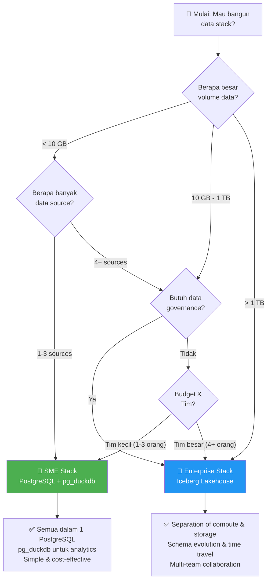

# 04 — Perbandingan Stack: SME vs Enterprise

## Perbandingan Komponen per Layer

| Layer | Aspek | SME (Haji Thoriq) | Enterprise (PJI Group) | Alasan Perbedaan |
|:------|:------|:-------------------|:----------------------|:----------------|
| **Source** | Sumber Data | CSV dari POS + inventori manual | SAP S/4HANA, Oracle DB, E-commerce APIs | Kompleksitas sumber data |
| **Source** | Jumlah Source | 2 | 4+ | Enterprise multi-system |
| **Source** | Volume | ~500 records/hari | ~5,000+ records/hari | Skala operasi |
| **Orchestration** | Tool | Apache Airflow 3.x | Apache Airflow 3.x | **SAMA** ✅ |
| **Orchestration** | Schedule | Daily (1x/hari) | Every 30 min | SLA lebih ketat |
| **Orchestration** | DAGs | 2 DAGs | 2 DAGs | **SAMA** ✅ |
| **Ingestion** | Tool | dlt | dlt | **SAMA** ✅ |
| **Ingestion** | Pipelines | 2 pipelines | 4 pipelines | Lebih banyak sumber |
| **Ingestion** | Destination | PostgreSQL (direct) | Apache Iceberg (via PyIceberg) | Scalability kebutuhan |
| **Storage OLTP** | Database | PostgreSQL 16 | PostgreSQL 16 (simulated SAP) | **SAMA** ✅ |
| **Storage OLAP** | Engine | pg_duckdb (in-process) | Apache Iceberg + MinIO | Skala data & governance |
| **Storage OLAP** | Capacity | ~1 GB cukup | 10 GB - 10 TB+ | Lakehouse elastis |
| **Storage OLAP** | Format | PostgreSQL rows | Parquet (columnar) | Optimal untuk analytics |
| **Transform SQL** | Tool | dbt Core | dbt Core | **SAMA** ✅ |
| **Transform SQL** | Adapter | dbt-postgres | dbt-duckdb (Iceberg) | Adapter sesuai storage |
| **Transform SQL** | Models | 9 models | 16 models | Bisnis logic lebih kompleks |
| **Transform Python** | Tool | Ibis Framework | Ibis Framework | **SAMA** ✅ |
| **Transform Python** | Backend | PostgreSQL | DuckDB + Iceberg | Backend sesuai storage |
| **Transform Python** | Models | 4 models | 4 models | **SAMA** ✅ |
| **BI Dashboard** | Tool | Streamlit | Streamlit | **SAMA** ✅ |
| **BI Dashboard** | Pages | 4 halaman | 5 halaman | Enterprise lebih detail |

---

## Decision Framework: Kapan Pakai Apa?

### Flowchart Pemilihan Stack



### Kriteria Detail

| Kriteria | Gunakan SME Stack | Gunakan Enterprise Stack |
|:---------|:-----------------|:------------------------|
| **Data Volume** | < 10 GB | > 10 GB atau growing fast |
| **Data Sources** | 1-3 sumber sederhana | 4+ sumber, termasuk ERP |
| **Team Size** | 1-3 data engineers | 4+ data engineers |
| **SLA** | Daily reporting cukup | Near real-time dibutuhkan |
| **Budget** | < Rp 5 juta/bulan | > Rp 5 juta/bulan |
| **Governance** | Tidak perlu audit trail | Butuh lineage, versioning |
| **Schema Changes** | Jarang | Sering berubah |
| **Multi-team** | 1 tim mengerjakan semua | Banyak tim consume data |
| **ML/AI** | Belum prioritas | Sudah/akan mulai |

---

## Portabilitas: Migrasi dari SME ke Enterprise

Salah satu kekuatan utama stack ini adalah **portabilitas**. Ketika bisnis SME berkembang menjadi enterprise, migrasi bersifat **incremental**, bukan rewrite total.

### Apa yang TIDAK Berubah

```
✅ Airflow DAGs     → Sama persis, hanya ganti task parameters
✅ dlt pipelines    → Ganti destination dari "postgres" ke "filesystem"
✅ Ibis transforms  → Ganti backend dari "postgres" ke "duckdb"
✅ dbt models       → Ganti adapter dari dbt-postgres ke dbt-duckdb
✅ Streamlit        → Ganti connection string saja
```

### Apa yang Berubah

```
🔄 Storage layer   → PostgreSQL → Iceberg + MinIO
🔄 dbt adapter     → dbt-postgres → dbt-duckdb
🔄 Ibis backend    → postgres → duckdb (Iceberg)
🔄 Docker compose  → Tambah MinIO + Iceberg REST services
```

### Contoh Migrasi dlt Pipeline

```python
# BEFORE: SME Stack (PostgreSQL destination)
pipeline = dlt.pipeline(
    pipeline_name="sales",
    destination="postgres",          # ← Ini yang berubah
    dataset_name="raw"
)

# AFTER: Enterprise Stack (Iceberg/filesystem destination)
pipeline = dlt.pipeline(
    pipeline_name="sales",
    destination="filesystem",        # ← Ganti destination
    dataset_name="raw",
    staging="filesystem"             # ← Tambah staging
)
```

### Contoh Migrasi Ibis Transform

```python
# BEFORE: SME Stack (PostgreSQL backend)
con = ibis.postgres.connect(
    host="postgres", port=5432,
    user="sme_user", database="sme_db"
)

# AFTER: Enterprise Stack (DuckDB + Iceberg backend)
con = ibis.duckdb.connect()
con.raw_sql("INSTALL iceberg; LOAD iceberg;")
# ... sama persis untuk logic transformasi
```

---

## Perbandingan Performance

| Metrik | SME Stack | Enterprise Stack | Catatan |
|:-------|:----------|:-----------------|:--------|
| **Query analitik sederhana** (1 tabel, aggregasi) | ~50 ms | ~100 ms | SME lebih cepat (in-process) |
| **Query analitik kompleks** (multi-join, window) | ~500 ms | ~300 ms | Enterprise parallelism lebih baik |
| **Full table scan 1M rows** | ~2 s | ~0.5 s | Iceberg columnar advantage |
| **Concurrent users** | 5-10 | 50-100+ | Enterprise scalable |
| **Data freshness** | T+1 (daily batch) | Near real-time (30 min) | Tergantung schedule |
| **Time travel** | ❌ Tidak ada | ✅ Via Iceberg snapshots | Enterprise feature |
| **Schema evolution** | ❌ Manual ALTER TABLE | ✅ Automatic via Iceberg | Enterprise feature |

---

## Cost Comparison

```
SME Stack: Bebek Goreng Haji Thoriq
┌──────────────────────────────────────────┐
│ Komponen          │ Biaya/Bulan          │
│───────────────────┼──────────────────────│
│ VPS (2 vCPU, 4GB) │ Rp 200,000          │
│ PostgreSQL        │ Rp 0 (open-source)   │
│ Airflow           │ Rp 0 (open-source)   │
│ dlt + dbt + Ibis  │ Rp 0 (open-source)   │
│ Streamlit         │ Rp 0 (open-source)   │
│ Domain + SSL      │ Rp 50,000            │
│───────────────────┼──────────────────────│
│ TOTAL             │ Rp 250,000/bulan     │
│                   │ (~$15/bulan)         │
└──────────────────────────────────────────┘

Enterprise Stack: PT Pesona Jelita Indonesia
┌──────────────────────────────────────────┐
│ Komponen          │ Biaya/Bulan          │
│───────────────────┼──────────────────────│
│ Cloud VMs (3x)    │ $1,500               │
│ Object Storage    │ $500                 │
│ Airflow (managed) │ $300                 │
│ Monitoring/Logs   │ $200                 │
│ Backup/DR         │ $500                 │
│ Support/Consulting│ $0 (community)       │
│───────────────────┼──────────────────────│
│ TOTAL             │ $3,000/bulan         │
│                   │ (~Rp 48 juta/bulan)  │
│                   │                      │
│ vs Legacy:        │ $96,250/bulan        │
│ SAVINGS:          │ 97% !!               │
└──────────────────────────────────────────┘
```

---

← [03 — Studi Kasus Enterprise](03-studi-kasus-enterprise.md) | [05 — Kesimpulan →](05-kesimpulan.md)
