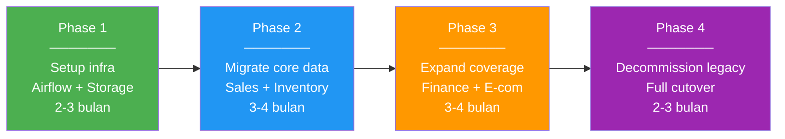

# 05 — Kesimpulan & Rekomendasi

## Key Takeaways

### 1. Satu Stack, Dua Skala

Modern Python Data Stack membuktikan bahwa **konsep arsitektur yang sama** bisa digunakan dari UMKM hingga enterprise. Perbedaannya hanya di **layer storage/OLAP**:

```
SME:        dlt → PostgreSQL + pg_duckdb → dbt/Ibis → Streamlit
Enterprise: dlt → Iceberg (MinIO)        → dbt/Ibis → Streamlit
            │         │                      │           │
            └─ SAMA ──┘──── BEDA ────────────┘── SAMA ──┘
```

### 2. Python sebagai Lingua Franca

Seluruh pipeline — dari ingestion hingga dashboard — ditulis dalam **Python dan SQL**. Tidak perlu Java, Scala, atau tool proprietary. Ini berarti:

- ✅ **Lebih mudah merekrut** — talent Python berlimpah
- ✅ **Lebih mudah maintain** — satu bahasa untuk seluruh stack
- ✅ **Lebih mudah iterate** — prototyping cepat, deploy cepat
- ✅ **Lebih mudah testing** — pytest, unit test standar

### 3. Open Source = Freedom

| Aspek | Proprietary Stack | Open Source Stack |
|:------|:-----------------|:-----------------|
| Vendor lock-in | ❌ Terikat kontrak | ✅ Bebas pindah |
| Biaya | 💰💰💰 | 💰 (hanya infra) |
| Customization | ❌ Terbatas | ✅ Full control |
| Community | ❌ Vendor support only | ✅ Global community |
| Audit | ❌ Black box | ✅ Source code terbuka |

### 4. Modernisasi ≠ Rewrite

Migrasi dari stack lama ke modern stack bisa dilakukan **bertahap**:



---

## Rekomendasi per Skala Bisnis

### UMKM / Startup (< 10 karyawan)

```
Rekomendasi: SME Stack
────────────────────────────────────
✅ PostgreSQL + pg_duckdb
✅ dlt (ingestion dari CSV/API)
✅ dbt-postgres (SQL transforms)
✅ Streamlit (dashboard)
⏳ Airflow (optional — bisa pakai cron dulu)

Biaya: Rp 0 - 250K/bulan
Timeline: 1-2 minggu setup
```

### UKM / Scale-up (10-100 karyawan)

```
Rekomendasi: SME Stack → Mulai plan Enterprise
────────────────────────────────────
✅ PostgreSQL + pg_duckdb (masih cukup)
✅ Airflow (sudah wajib)
✅ dlt + dbt + Ibis (full stack)
✅ Streamlit (dashboard)
🔄 Evaluasi migrasi ke Iceberg jika data > 10 GB

Biaya: Rp 500K - 2 juta/bulan
Timeline: 2-4 minggu setup
```

### Enterprise (100+ karyawan)

```
Rekomendasi: Enterprise Stack
────────────────────────────────────
✅ Apache Iceberg + MinIO (lakehouse)
✅ Airflow (production-grade)
✅ dlt + dbt + Ibis (full stack)
✅ Streamlit (dashboard, multi-tenant)
✅ Data governance (Iceberg metadata)
✅ CI/CD pipeline untuk dbt models

Biaya: $1,000 - $5,000/bulan
Timeline: 2-6 bulan (phased migration)
```

---

## Roadmap Adopsi untuk Indonesia

### Fase 1: Awareness (Sekarang)
- ✅ Presentasi di Python meetup (seperti ini!)
- ✅ Tutorial dan workshop berbahasa Indonesia
- ✅ Open source starter kit (proyek ini!)

### Fase 2: Early Adoption (6-12 bulan)
- 🔄 Pilot project di UMKM digital-savvy
- 🔄 Partnership dengan universitas (kurikulum data engineering)
- 🔄 Case study publication

### Fase 3: Mainstream (1-2 tahun)
- 📅 Enterprise adoption di mid-market companies
- 📅 Managed service providers di Indonesia
- 📅 Indonesian data engineering certification

### Fase 4: Standard (2-3 tahun)
- 📅 Modern data stack menjadi standar industri
- 📅 Regulatory compliance tools (OJK, BPOM)
- 📅 Indonesian companies contributing to open source

---

## Resources & Komunitas

### Learning Resources

| Resource | URL | Bahasa |
|:---------|:----|:-------|
| dlt Documentation | https://dlthub.com/docs | English |
| dbt Learn | https://courses.getdbt.com | English |
| Ibis Documentation | https://ibis-project.org | English |
| Airflow Documentation | https://airflow.apache.org | English |
| Streamlit Documentation | https://docs.streamlit.io | English |
| Apache Iceberg | https://iceberg.apache.org | English |

### Komunitas Indonesia

| Komunitas | Platform |
|:----------|:---------|
| Python ID | Telegram, Discord |
| Data Engineering Indonesia | Telegram |
| dbt Indonesia | Slack |
| Apache Indonesia | Meetup |

### Buku Referensi

1. **"Fundamentals of Data Engineering"** — Joe Reis & Matt Housley
2. **"Data Pipelines with Apache Airflow"** — Bas Harenslak & Julian de Ruiter
3. **"The dbt Book"** — dbt Labs (online, gratis)

---

## FAQ

### Q: Apakah stack ini production-ready?
**A:** Ya! Semua komponen sudah production-ready. PostgreSQL, Airflow, dbt, dan Streamlit sudah digunakan oleh ribuan perusahaan. Apache Iceberg digunakan oleh Netflix, Apple, dan LinkedIn.

### Q: Bagaimana dengan keamanan data?
**A:** Semua data tetap di infrastruktur Anda sendiri (self-hosted). Tidak ada data yang dikirim ke third-party. Untuk enterprise, gunakan encryption at rest (MinIO) dan in-transit (TLS).

### Q: Apakah bisa diintegrasikan dengan ML/AI?
**A:** Tentu! Iceberg tables bisa dibaca langsung oleh Pandas, PyArrow, dan framework ML apapun. dbt juga mendukung Python models untuk ML feature engineering.

### Q: Bagaimana handle data yang sangat besar (petabyte)?
**A:** Untuk skala petabyte, gunakan Iceberg + cloud object storage (S3/GCS) + Spark atau Trino sebagai compute engine. Stack yang sama, hanya scale compute.

### Q: Apakah ada support berbayar?
**A:** Ya, sebagian besar tools menawarkan enterprise support:
- **Astronomer** — Managed Airflow
- **dbt Cloud** — Managed dbt
- **Tabular / Snowflake** — Managed Iceberg
- **Streamlit Cloud** — Managed Streamlit

---

## Terima Kasih! 🙏

```
┌─────────────────────────────────────────────────────────┐
│                                                         │
│   "The best data stack is the one that works            │
│    for YOUR scale, with YOUR team,                      │
│    and grows WITH your business."                       │
│                                                         │
│                          — Modern Data Stack Philosophy │
│                                                         │
└─────────────────────────────────────────────────────────┘
```

### Source Code

Seluruh source code tersedia di repository ini. Silakan fork, star, dan contribute!

---

← [04 — Perbandingan Stack](04-perbandingan-stack.md) | [🏠 README](../README.md)
